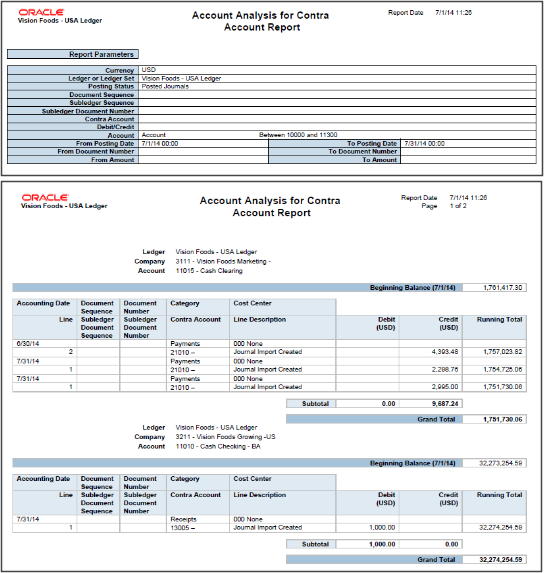

# Oracle's General Ledger Account Analysis Reports

## Introduction
This VBA for Excel script parses Oracle's standard General Ledger Account Analysis Report for a
360 view on what's hitting your GLs and a deeper dive into financial / data analysis, and audit.

More information about Oracle's General Ledger Account Analysis Report at:
https://docs.oracle.com/en/cloud/saas/financials/23b/ocuar/general-ledger-account-analysis-reports.html

## How to use this script?
* Export GLA report from Oracle using parameters of choice and save in XLSX or XLS format.
* Open VBA Editor (ALT + F11) and paste this script.
* Execute/run (F5)

## Support
Feel free to open issue in 'support' section.

## Credits
GL account analysis standard report parser by voidbydefault https://github.com/voidbydefault/

### My YouTube channels
Linux: https://youtube.com/@LivingLinux101

Ideas and general rant: https://youtube.com/@taimurSM
